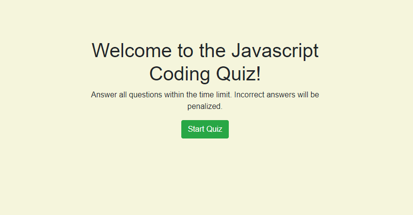

# Code Quiz

## Challenge Details

Web APIs Challenge: Code Quiz

-Timed code quiz

-When you click start a timer begins counting down

-When question is answered you are presented with a new question

-When question is answered incorrectly time is deducted from timer

-When all questions are answered or timer reaches 0, the game is over

-When the game is over you can enter your initials and save high score

[Quiz Link](https://woodb58.github.io/quiz-challenge/)

